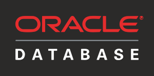

# Getting Started
A demo project for a reactive web application that serves 
data from an Oracle database via GraphQL.

<table>
<tbody>
<tr>
<td></td>
<td></td>
<td></td>
</tr>
</tbody>
</table>

### Features
- Fully reactive web Application.
- Support for reactive DB connection to an Oracle database via `R2DBC`.
- Initializing database via `Flyway`. 
- Examples for: `GraphQL-SpringBoot` mappings annotations.
- Examples for: `Auto-generation` of GraphQL model classes. 
- Examples for: `GraphQL Error Handling`.

### Testing
- A [docker-compose.yml](docker-compose.yml) file is provided to start the database.
- Run `mvn clean flyway:migrate` to execute DB Migration.
- If you have a problem dropping database tables:
```sql
ALTER SYSTEM SET ddl_lock_timeout=20;
```

#### GraphQL code generation with DGS
This project has been configured to use the Netflix DGS Codegen plugin.  
This plugin can be used to generate client files for accessing remote GraphQL services.  
The default setup assumes that the GraphQL schema file for the remote service is added to
the `src/main/resources/graphql-client/` location.  
You can learn more about the [plugin configuration options](https://github.com/deweyjose/graphqlcodegen) and
[how to use the generated types](https://netflix.github.io/dgs/generating-code-from-schema/) to adapt the default setup.
